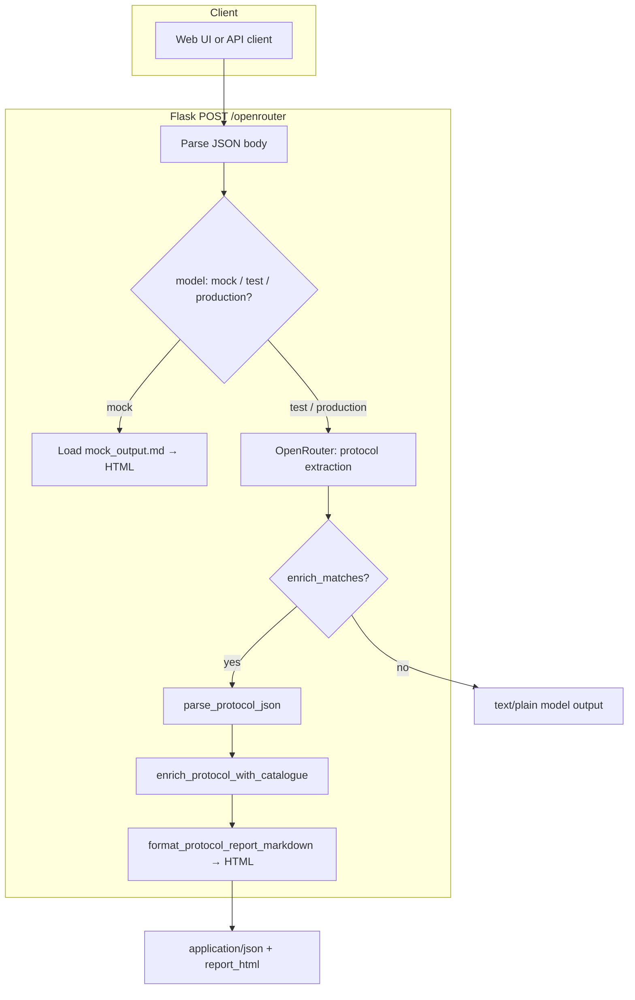

# Input processing

This document describes how user and API input flows through **Alternative Methods Finder**: from the HTTP request to protocol JSON, optional DB-ALM enrichment, and the rendered report.

**Deeper detail** on extraction, normalization, scoring, and top-hit selection (up to `catalogue_hits`): see [PROTOCOL_EXTRACTION_AND_MATCHING.md](./PROTOCOL_EXTRACTION_AND_MATCHING.md).

## End-to-end flow



## 1. Request body (`POST /openrouter`)

The body **must be JSON** (`Content-Type: application/json`). Fields:

| Field | Required | Description |
|:---|:---|:---|
| `prompt` | Yes, except in **mock** mode | Free text: typically a “Materials and Methods” excerpt or experiment description. In **mock**, it is ignored for catalogue logic but may still be sent. |
| `model` | No (default `test`) | Run mode: `mock`, `test`, or `production`. Maps to backend behaviour and LLM model (see below). |
| `enrich_matches` | No (default `false` for bare API clients) | If `true` and mode is not `mock`, the model output is parsed as protocol JSON, matched against the DB-ALM catalogue, and a markdown/HTML report is built. The web UI always sends `true`. |
| `max_catalogue_matches` | No (default `5`) | Number of catalogue rows to keep **per protocol section** after ranking. Clamped to **3–5** in code. |

Invalid or non-JSON body → **400** with `{"error": "..."}`.

Implementation: `main.py` (`open_router_test`).

## 2. Run modes (`model`)

| Value | LLM | Notes |
|:---|:---|:---|
| `mock` | None | Reads `method_finder/infrastructure/mock_output.md`, converts to HTML with Python-Markdown (tables + line breaks). Returns `text/html`. **`prompt`** not required. **`enrich_matches`** is not applied on this branch. |
| `test` | `openai/gpt-4o` via OpenRouter | Default development model. |
| `production` | `anthropic/claude-3.5-sonnet` via OpenRouter | Same pipeline as `test`, different model id. |

Unknown `model` values fall back to **`test`**.

## 3. Turning `prompt` into protocol JSON (LLM path)

For `test` and `production`:

1. **`API_KEY`** or **`OPENROUTER_API_KEY`** is read from the environment (`.env` is loaded at startup via `python-dotenv` in `main.py`). Missing key → clear error before calling the API.

2. The string `prompt` is inserted into the user message template with a **literal replace** of `{user_input}` (so stray `{` / `}` in the user text do not break formatting). See `PROTOCOL_EXTRACTOR_PROMPT_TEMPLATE` in `method_finder/infrastructure/openrouter_client.py`.

3. OpenRouter is called with:
   - **system**: `SYSTEM_PROMPT` (bio-informatics / 3Rs / OECD framing).
   - **user**: full extractor instructions + `Input Text:` + user paste.

4. The assistant message **content** is returned as a string. It is expected to be **JSON** (one object or an array of objects) describing animal-use protocol sections (`section_id`, `domain`, `test_description`, `species`, `sample_size`, `administration_route`, `endpoints_measured`, `duration`, `is_regulatory_standard`, etc.).

5. If **`enrich_matches`** is **false**, that string is returned to the client as **`text/plain`** unchanged.

Errors from OpenRouter or missing/invalid responses are surfaced as JSON errors (e.g. **502**) where applicable.

## 4. Parsing model output (`enrich_matches: true`)

1. **`parse_protocol_json`** (`method_finder/matching/protocol_matching.py`) returns **`(sections, study_summary)`**:
   - Strips optional fenced blocks: ` ```json ... ``` `.
   - Preferred: `{"study_summary": "...", "experiments": [ ... ]}`.
   - Legacy: a bare array of experiment objects, or a single experiment object.

2. The enriched JSON response includes **`study_summary`** when the model provided it; the report’s **Input summary** uses it, else a truncated **`prompt`**.

3. Failure → **502** `"Model output is not valid protocol JSON"`.

## 5. DB-ALM catalogue (in-memory)

- Loaded at app startup from `db/DBALM_Catalogue.csv` via `method_finder/infrastructure/alm_catalogue.py` (`load_catalogue` / `get_catalogue`).
- **Protocol → Topic area bridge** (domain labels, phrases, and synonyms in one place) is read from **`db/protocol_bridge.json`** when `method_finder.matching.protocol_matching` is imported (`load_protocol_bridge` / **`PROTOCOL_BRIDGE`**); restart the server after editing that file.
- **Column names** are trimmed; **`Title`** suffix **` - Summary`** is removed.
- **`Topic area`**, **`Models and Strategies`**, **`Experimental systems`**: split into **lists** (multi-value cells).
- **`Biological endpoints`**: split on **newlines** into a list of lines.
- Derived column **`validation_tier`** describes validation wording used in the UI/report.

If the catalogue cannot be loaded when enrichment is requested → **503**.

## 6. Per-section processing (enrichment)

For each protocol object in the parsed list:

1. **`domain`** (string) is passed through **`TopicNormalizer`** (`method_finder/domain/topic_mapping.py`): fixed synonyms, then fuzzy match to an official topic list (`rapidfuzz`).

2. **`normalized_domain`** (from **`TopicNormalizer`**) and the **raw** **`domain`** string drive the **topic gate** together with a search blob from **`test_description`** / **`endpoints_measured`**: `filter_catalogue_by_topic(..., synonym_blob=…)` keeps rows where **any** catalogue **`Topic area`** value matches **any** expanded term. Extra terms come from **`db/protocol_bridge.json`** (`groups` + `rules`: substring and label triggers). See [PROTOCOL_EXTRACTION_AND_MATCHING.md §3](./PROTOCOL_EXTRACTION_AND_MATCHING.md).

3. Each remaining row gets a **match breakdown** (`compute_match_breakdown` in `method_finder/matching/protocol_matching.py`):
   - **Regulatory authority** (1–3): OECD TG signals vs EURL/ECVAM/TSAR/`No.` vs research-style defaults.
   - **Endpoint coverage** (0–3): full / partial / proxy / none, comparing **`endpoints_measured`** to catalogue **`Biological endpoints`** (plus small proxy keyword groups).

4. **`match_score`** — integer **0–100** used for **sorting** only (not a calibrated probability). It preserves the same ordering as the legacy formula `regulatory_authority_score * 100 + endpoint_coverage_score` (authority dominates, then endpoint coverage).

5. Only the **top `max_catalogue_matches`** rows (clamped 3–5) per section are kept in **`catalogue_hits`**.

## 7. Report generation

- **`format_protocol_report_markdown`** (`method_finder/presentation/protocol_report.py`) builds markdown styled like **`method_finder/infrastructure/mock_output.md`**: title, metadata table, then for each protocol section a **`## Section …`** heading, optional mapped-topic line, **`### Extracted parameters`** (vertical `Parameter | Value` table for that section only), **`### Recommended alternatives`**, tool insight blockquote, horizontal rule; closing **Summary recommendation**. If no experiments were parsed, a short note appears after the first `---` instead of section blocks.
- **Validation (DB-ALM)** column: OECD test-guideline mentions link to **OECD iLibrary** search URLs; standalone **OECD** links to the OECD chemicals assessment topic page (word links are applied before TG links so hostnames in URLs are not corrupted).
- **Regulatory links** column (recommended alternatives table): **OECD standard** links (iLibrary search per TG) when a TG / OECD test guideline number is detected in title, validation, or regulatory text; **Validation background** links to **TSAR** (`tsar.jrc.ec.europa.eu`) when present in catalogue regulatory/supplementary fields. If there is no OECD TG signal but a TSAR URL exists, **Regulatory (TSAR)** is the primary regulatory link; if the text references TSAR without a URL, the TSAR portal is linked. **DB-ALM** method URLs are always included.
- **Summary recommendation**: if **no** section has any **`catalogue_hits`**, the closing paragraph explains that no DB-ALM matches were returned and suggests refining the excerpt or searching the catalogue manually; otherwise it keeps the “ranked alternatives / regulatory authority / proxy” guidance.
- **`main.py`** converts that markdown to HTML (same extensions as mock) and returns JSON:
  - `model_output` — raw LLM string  
  - `protocol_sections` — enriched structures + hits  
  - `report_markdown`, `report_html`  
  - `max_catalogue_matches`  

The web UI, when it receives JSON containing **`report_html`**, renders that HTML in the result panel.

## 8. Web UI input

`templates/index.html` sends:

- `prompt` from the textarea  
- `model` from the mode control (`mock` / `test` / `production`)  
- `enrich_matches` is always `true` (DB-ALM report included for test/production)  

**Sample methods** dropdown: options are rendered from `db/sample_input.json` at page load; full text is loaded via **`GET /api/sample-inputs`** and applied on change using each row’s **`full_methods_text`** (with **`original_methods_text`** as a backward-compatible alias).

It does not currently expose `max_catalogue_matches`; clients can POST it directly for 3–5 hits per section.

## Related files

| Concern | Location |
|:---|:---|
| Route + orchestration | `main.py` (`/`, `/openrouter`, `/api/sample-inputs`) |
| OpenRouter + prompts | `method_finder/infrastructure/openrouter_client.py` |
| CSV load + preprocessing | `method_finder/infrastructure/alm_catalogue.py` |
| Topic normalization | `method_finder/domain/topic_mapping.py` |
| Parse JSON, filter, score | `method_finder/matching/protocol_matching.py` |
| Markdown report | `method_finder/presentation/protocol_report.py` |
| Static mock narrative | `method_finder/infrastructure/mock_output.md` |
