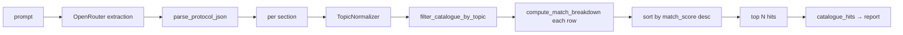

# Protocol extraction, matching, and selection

This document describes the pipeline from **raw user text** through **structured protocol sections**, **DB-ALM row filtering**, **scoring**, and **selection of the top catalogue hits** that feed the report. It stops before full markdown/HTML report formatting (see `method_finder/presentation/protocol_report.py`). **Validation-column OECD links** and the **conditional summary** (when no hits) are summarized in [INPUT_PROCESSING.md §7](./INPUT_PROCESSING.md).

For HTTP and run modes, see [INPUT_PROCESSING.md](./INPUT_PROCESSING.md).

---

## 1. Protocol extraction (LLM)

### 1.1 Input

- The **`prompt`** string is user-supplied text (typically a “Materials and Methods” excerpt or similar).
- It is inserted into the extractor template by **literal replacement** of the placeholder `{user_input}` so braces inside the user text do not break formatting (`method_finder/infrastructure/openrouter_client.py`).

### 1.2 Messages sent to OpenRouter

| Role | Content |
|:---|:---|
| **system** | `SYSTEM_PROMPT` — bio-informatics assistant framing, 3Rs, OECD-oriented extraction task. |
| **user** | `PROTOCOL_EXTRACTOR_PROMPT_TEMPLATE` with the user text appended after `Input Text:`. The template defines the JSON fields to extract, domain categories, trigger keywords, and rules (one object per distinct animal experiment, ignore non-animal sections, etc.). |

The model is **not** forced to return JSON-only via API `response_format`; the app expects the assistant **message content** to be parseable JSON.

### 1.3 Intended JSON shape (per section)

Each extracted protocol is a JSON **object** with fields such as:

| Field | Role in later steps |
|:---|:---|
| `section_id` | Identity in the report (e.g. `"3.5.1"`). |
| `domain` | **Raw** domain label from the model (e.g. `Skin Irritation`, `Acute Tox`). Fed to **TopicNormalizer** for catalogue filtering. |
| `model_type` | One of `in vivo`, `ex vivo`, `in vitro`, `in silico`; shown as **Model type** in the report. |
| `category` | Same high-level label as `domain` (for the **Extracted protocol parameters** vertical table); if missing, the report uses `domain`. |
| `is_alternative_method` | Boolean — **true** if the block is already ex vivo / in vitro / non–live-animal for that endpoint; **false** for conventional in vivo tests. Shown as **3Rs / alternative method** (Yes/No). Downstream code can use this to decide whether DB-ALM matching is a priority. |
| `test_description` | Human-readable procedure summary; **Procedure** row in the per-experiment parameter table. |
| `species`, `strain`, `sex`, `sample_size`, `administration_route`, `duration` | Shown in that section’s **Extracted parameters** table in the report. |
| `organs_or_tissues` | List of strings (or omitted); organs/tissues collected or examined — **Organs / tissues** row. |
| `test_article` | Optional substance/product name for that experiment — **Test article** row. |
| `endpoints_measured` | String or list of strings; parsed into a lowercase **blob** and **token list** for **endpoint coverage** scoring; also in the table. |
| `is_regulatory_standard` | Boolean; **Regulatory reference** row (Yes/No) in the table. |

The assistant may return a **single object** or an **array** of objects.

### 1.4 Parsing (`parse_protocol_json`)

Implemented in `method_finder/matching/protocol_matching.py`. Returns **`(sections, study_summary)`**:

1. Trim whitespace; strip optional ` ```json ... ``` ` fences.
2. `json.loads` the result.
3. **Preferred:** a single object with **`study_summary`** (string) and **`experiments`** (array of protocol objects). Also accepts **`protocol_sections`** instead of **`experiments`**, and **`input_summary`** as an alias for **`study_summary`**.
4. **Legacy:** a JSON **array** of experiment objects → `study_summary` is `""`.
5. **Legacy:** one experiment object without wrapper keys → one-element list, `study_summary` `""`.

Failure raises `ValueError` / `JSONDecodeError`; the API maps that to a **502** when `enrich_matches` is true.

The report’s **Input summary** row prefers the model’s **`study_summary`**; if empty, it falls back to a truncated raw **`prompt`**.

---

## 2. Domain normalization (before catalogue filter)

For **each** protocol object:

1. Read **`domain`** (coerced to string if needed).
2. Run **`TopicNormalizer.normalize(domain)`** (`method_finder/domain/topic_mapping.py`):
   - Lowercase and strip.
   - If the string matches a **direct map** (e.g. `skin irritation` → `Skin Irritation and Corrosivity`), return the mapped label.
   - Else **`rapidfuzz.process.extractOne`** against **`official_topics`** with **`fuzz.WRatio`**; if the score **> 80**, return the best match.
   - Else return the **original** string.

3. Store the result as **`normalized_domain`** on the enriched section.

**Catalogue filtering** uses **`normalized_domain`**, the raw **`domain`**, and a lowercase blob built from **`test_description`** and **`endpoints_measured`** (see §3). Extra **Topic area** search terms come from a single bridge file **`db/protocol_bridge.json`** (loaded at import as **`PROTOCOL_BRIDGE`** via **`load_protocol_bridge`**); restart the app after editing it.

---

## 3. Catalogue candidate set (topic gate)

The in-memory DataFrame comes from **`parse_alm_database`** (`method_finder/infrastructure/alm_catalogue.py`): comma-separated **`db/DBALM_Catalogue.csv`** (RFC-style quoting for multiline cells), stripped headers, list columns for **Topic area**, etc.

### 3.1 `filter_catalogue_by_topic(df, normalized_domain, raw_domain="", *, synonym_blob="")`

Implemented in `method_finder/matching/protocol_matching.py`. If **`normalized_domain`**, **`raw_domain`**, and **`synonym_blob`** are all empty after stripping, the filter returns **no rows**.

**`enrich_protocol_with_catalogue`** sets **`synonym_blob`** from **`_build_synonym_search_blob`**: `domain`, **`normalized_domain`**, **`test_description`**, and **`endpoints_measured`** concatenated (lowercased for matching).

Otherwise **`_topic_keywords_for_domains`** builds a **set of search strings** (lowercased where applicable, minimum length 2):

1. The **normalized** and **raw** domain strings themselves.
2. **`protocol_bridge.json`** — **`groups`**: named lists of catalogue-oriented keywords (e.g. `acute_toxicity` → Acute, Basal Cytotoxicity, Systemic Toxicity). **`rules`**: each rule has **`match`** `substring` or `label`, **`text`**, and either **`group`** (pull keywords from that group id) or **`keywords`** (inline list).  
   - **`substring`**: `text` must appear inside **`synonym_blob`** (domain + normalized + test description + endpoints, lowercased). Covers colloquial phrases (e.g. `acute tox`, `draize eye test`).  
   - **`label`**: `text` must **overlap** raw or normalized domain (substring either way, case-insensitive). Covers TopicNormalizer outputs and bucket-style labels (e.g. `Acute Systemic Toxicity`, `Skin & Eye Irritation`).

Protocol “bridge” terms and assay **synonyms** use the same **`rules`** list — there is no separate synonym file. Example: **EVEIT**, **Ex Vivo Eye Irritation Test**, **perfusion corneal culture**, and **ACTO e.V.** expand via **`bovine_ocular_ex_vivo`** in **`protocol_bridge.json`** (and **`TopicNormalizer`** direct maps) toward **Eye Irritation** catalogue rows, including **Bovine Isolated Cornea Test** (No. 1) and **BCOP** (No. 98).

A catalogue row **passes** the gate if **any** string in its **`Topic area`** list matches **any** keyword in that set:

- Case-insensitive.
- Substring in **either** direction: `keyword ∈ topic` or `topic ∈ keyword`.

Rows that fail this gate are **not scored** and never appear in **`catalogue_hits`**.

**`catalogue_match_count`** is the count of rows passing this filter (before top-*N* truncation).

**Symbols:** `filter_catalogue_by_topic`, `_topic_domain_overlaps`, `_topic_keywords_for_domains`, `_build_synonym_search_blob`, **`load_protocol_bridge`**, **`PROTOCOL_BRIDGE`**; data file **`db/protocol_bridge.json`** (restart the app after edits).

---

## 4. Matching score (per protocol section × catalogue row)

For **each** row in the candidate set, **`compute_match_breakdown(section, catalogue_row)`** returns:

- **`regulatory_authority_score`** (1–3) and **`regulatory_authority_tier`** (`high` / `medium` / `low`)
- **`endpoint_coverage_score`** (0–3) and **`endpoint_coverage_tier`** (`full` / `partial` / `proxy` / `none`)
- **`match_score`** — integer **0–100**, used **only for ordering** within the section (not a calibrated probability)

**Note:** `normalized_domain` is passed through for API stability; **topic overlap is not re-added** into the numeric score (the topic gate already applied).

### 4.1 A. Regulatory authority (“ethics / authority”)

Evaluated on concatenated lowercase text from catalogue columns: **Title**, **Regulatory  information**, **Supplementary materials (Downloads)**, **Document type**, **`validation_tier`**, **EUProject**, plus the precomputed **`validation_tier`** string for keyword checks.

| Tier | Points | Logic (first match wins, top to bottom) |
|:---|:---:|:---|
| **high** | 3 | Regex finds an **OECD Test Guideline** style reference (e.g. `TG 431`, `Test Guideline 129`, `OECD … guideline …`). |
| **medium** | 2 | Not high, and any of: **`No.`** is a positive integer (DB-ALM validated ID); or **TSAR** + “valid”; or **EURL** + **ECVAM**; or **`validation_tier`** contains validated + OECD/ECVAM/EURL. |
| **low** | 1 | **NC3Rs** in text, or “scientific alternative” / **R&D** in `validation_tier`, or **default** if nothing above matched. |

### 4.2 B. Endpoint coverage (“scientific” alignment)

**Protocol side:** `endpoints_measured` is normalized to a lowercase **blob** and **parts** list (split on comma, semicolon, newline if string; list elements lowercased).

**Catalogue side:** each line in **`Biological endpoints`** (list) is compared to the protocol blob/parts. The **best** per-line score defines the row’s endpoint tier:

| Tier | Points | Meaning (implementation summary) |
|:---|:---:|:---|
| **full** | 3 | Catalogue endpoint appears in protocol text (**substring** match) **and** strong agreement: shared **assay tokens** (`_ASSAY_MARKERS`, e.g. LD50, MTT, ALT), or ≥2 shared alphanumeric tokens, or long phrase (≥10 chars) contained in blob. |
| **partial** | 2 | Weaker substring match only, **or** no direct substring but **token overlap** (Jaccard on tokens length >2) with ratio ≥ **0.18** or ≥2 intersecting tokens. |
| **proxy** | 1 | No full/partial hit, but a **curated pair** matches: keywords from the protocol blob and keywords from the catalogue endpoint line appear in the same **`_ENDPOINT_PROXY_GROUP`** (e.g. serum/ALT ↔ viability/hepatotoxicity; LD50 ↔ NRU/3T3; histology ↔ organoid/chip). |
| **none** | 0 | No protocol endpoints, no catalogue endpoints, or no match. |

The row’s **`endpoint_coverage_*`** fields reflect the **maximum** score across all **`Biological endpoints`** lines for that row.

### 4.3 Combined `match_score` (sorting key)

```text
rank = (regulatory_authority_score − 1) × 4 + endpoint_coverage_score   # 0 … 11
match_score = round(100 × rank / 11)   # 0 … 100
```

**Regulatory authority still dominates** ordering: any higher authority tier outranks a lower tier regardless of endpoint (same ordering as the legacy scalar `authority × 100 + endpoint`). Only **12** distinct scores exist, so the number reads as a **rank on a 0–100 ruler**, not a smooth similarity or confidence.

---

## 5. Selection for output (`catalogue_hits`)

Within **each** protocol section:

1. Build a list of **`(match_score, record)`** for every **topic-filtered** row.
2. Each **record** merges the **breakdown** fields with catalogue columns **Title**, **No.**, **`validation_tier`** (JSON-safe scalars).
3. **Sort** by **`match_score` descending**.
4. **Take the first `max_hits_per_section`** rows (default **5**, request body **`max_catalogue_matches`** clamped to **3–5** via **`clamp_top_matches`** in `main.py`).

The resulting list is **`catalogue_hits`** — this is exactly what the **report generator** and **`protocol_sections`** JSON use; no second re-ranking happens before the report.



---

## Source of truth (code)

| Step | Module / symbol |
|:---|:---|
| Prompts + OpenRouter call | `method_finder/infrastructure/openrouter_client.py` — `SYSTEM_PROMPT`, `PROTOCOL_EXTRACTOR_PROMPT_TEMPLATE`, `complete_openrouter_extraction` |
| JSON parse | `method_finder/matching/protocol_matching.py` — `parse_protocol_json` |
| Domain map + fuzzy | `method_finder/domain/topic_mapping.py` — `TopicNormalizer` |
| Topic filter + protocol bridge | `method_finder/matching/protocol_matching.py` — `filter_catalogue_by_topic`, `_topic_keywords_for_domains`, `_topic_domain_overlaps`, `_build_synonym_search_blob`, `load_protocol_bridge`, `PROTOCOL_BRIDGE`; **`db/protocol_bridge.json`** |
| Regulatory + endpoint scores | `method_finder/matching/protocol_matching.py` — `regulatory_authority_tier`, `endpoint_coverage_tier`, `compute_match_breakdown` |
| Sort + slice | `method_finder/matching/protocol_matching.py` — `enrich_protocol_with_catalogue` |
| Request clamp | `method_finder/matching/protocol_matching.py` — `clamp_top_matches`; wired in `main.py` |
